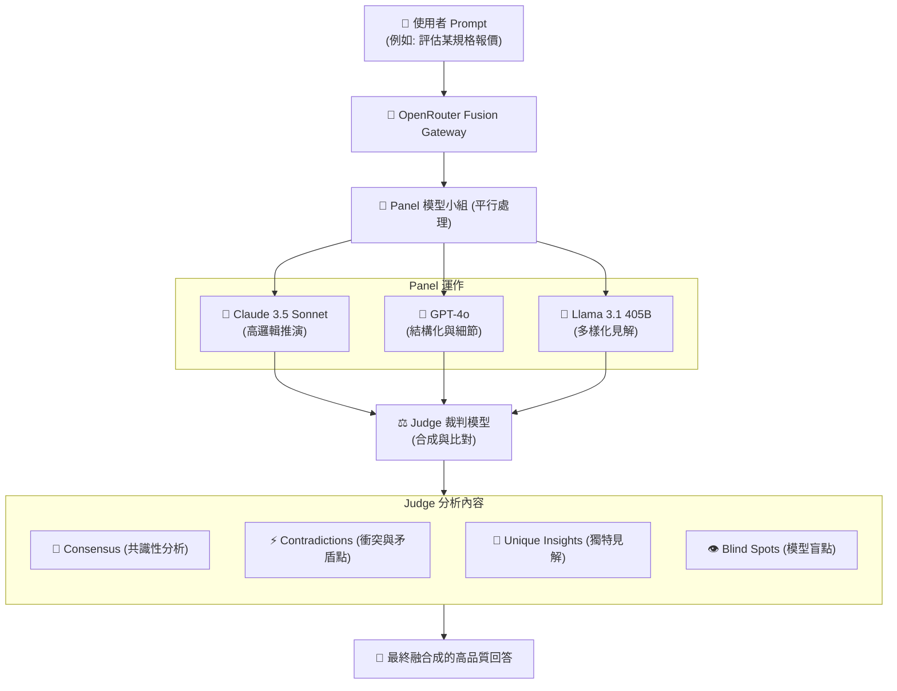

# 📊 OpenRouter Fusion API 在報價與行銷文案之落地可能性評估報告

> **文件狀態**：草案評估 (Draft)  
> **日期**：2026-06-17  
> **評估人**：AntiGravity (AG)  
> **主要對象**：Jacob / 專案團隊  
> **專案關聯**：[銷售專案](file:///Users/jacob/Library/CloudStorage/GoogleDrive-chen.uvtai12@gmail.com/我的雲端硬碟/2026%20antig2/銷售專案)

---

## 💡 執行摘要 (Executive Summary)

**OpenRouter Fusion API** 是 OpenRouter 於 2026 年 6 月推出的一項革命性**多模型合成（Compound Model Deliberation）技術**。不同於傳統單一模型的 API 呼叫，Fusion API 採用「平行派發、裁判融合」機制，能以頂尖前沿模型（Frontier Models）的平均或更低成本，達到超越單一模型之邏輯性、嚴謹度與創意思維。

本報告旨在評估將 Fusion API 落地於「**專案規格報價**」與「**行銷文案創作**」兩大商務核心場景之可行性，並規劃在 `n8n` 自動化工作流中的實作架構與性價比分析。

---

## ⚙️ 一、 Fusion API 核心運作機制

Fusion API 在收到使用者的 Prompt 後，會啟動以下三階段的協同運作流程：



1.  **平行派發 (Parallel Analysis)**：Prompt 被同時派送給由多個高效能模型組成的面板（Panel），模型們會各自獨立思考、檢索資料並給出解答。
2.  **裁判分析 (Synthesis by Judge)**：一個專用的「裁判模型（Judge Model）」負責閱讀並比對 Panel 的所有輸出，自動分析其**共識（Consensus）**、**矛盾點（Contradictions）**、**獨特見解（Unique Insights）**與**盲點（Blind Spots）**。
3.  **最終融合 (Final Synthesis)**：將裁判結果與原始 Prompt 進行深度融合，由主模型撰寫出一個兼具邏輯嚴密性與多元視角的 final response。

---

## 🎯 二、 落地場景可行性分析

### 場景 1：專案規格評估與報價（高精準度需求）

專案估時與報價是商業開發中容錯率極低的環節。單一模型容易產生**幻覺**，或因脈絡理解偏差導致高估或低估工時。

*   **落地價值**：
    *   **工時共識（Consensus）**：如果 Claude 評估某功能需要 5 天，GPT-4o 評估 6 天，裁判模型能得出「5~6 天為合理基準」的共識。
    *   **捕捉衝突（Contradictions）**：若某模型認為該功能只需 2 小時（當成套用套件），另一模型認為要 5 天（當成底層自建），裁判模型會立刻指出此衝突，並分析兩者的假設前提，防範報價暴雷。
    *   **發現盲點（Blind Spots）**：分析該報價是否遺漏了「安全驗證、API 流量限制、 Zeabur 部署設定」等客戶未明說但實務上必須做的工程項目。
*   **可行性評級**：⭐⭐⭐⭐⭐ (極高，能顯著降低商務開發的工程風險)。

---

### 場景 2：行銷文案與 LINE 推播創作（高創意與合規需求）

台灣市場的文案創作既需要在地化創意（例如 Apple 風格的精簡排版、溫暖筆調），又必須嚴格遵守消保法與公平交易法中有關廣告誇大不實之規範。

*   **落地價值**：
    *   **創意碰撞**：利用 Panel 中不同風格的模型平行生成多個切入點（情感訴求、成本對比、痛點引導），再由裁判模型提取各自的「獨特見解（Unique Insights）」。
    *   **合規與防雷（Blind Spots）**：裁判模型能扮演合規審查官，檢查文案中是否有「最先進、保證有效、第一品牌」等在台灣法規中容易被檢舉罰款的詞彙。
    *   **語氣一致性**：融合成最後文案時，確保其語氣符合 [meidi-home-site](file:///Users/jacob/Library/CloudStorage/GoogleDrive-chen.uvtai12@gmail.com/我的雲端硬碟/2026%20antig2/meidi-home-site) 或品牌所需的溫和、專業基調。
*   **可行性評級**：⭐⭐⭐⭐ (高，能一次產出兼具多重文筆特色且合規的文案)。

---

## 💻 三、 n8n 自動化工作流實作架構

在 n8n 中，我們可以透過 `HTTP Request` 節點非常輕量地調用 OpenRouter Fusion API，無需更改任何基礎代碼架構。

### 1. 呼叫方式 (Model Alias 模式)
最直觀的方法是直接呼叫 `openrouter/fusion` 模型，讓 OpenRouter 雲端自動調配 Panel 與 Judge 模型。

*   **API Endpoint**: `https://openrouter.ai/api/v1/chat/completions`
*   **Headers**:
    *   `Authorization: Bearer {{ $credentials.openRouterApi.apiKey }}`
    *   `Content-Type: application/json`
    *   `HTTP-Referer: https://jacob-html-slides-2026.web.app` (選填，OpenRouter 排名用)

### 2. n8n HTTP Request 節點 JSON 配置範本

您可以直接複製以下 JSON 區塊並貼入您的 n8n 工作流畫布中：

```json
{
  "parameters": {
    "method": "POST",
    "url": "https://openrouter.ai/api/v1/chat/completions",
    "authentication": "predefinedCredentialType",
    "nodeCredentialType": "openAiApi",
    "sendHeaders": true,
    "headersUi": {
      "values": [
        {
          "name": "Content-Type",
          "value": "application/json"
        }
      ]
    },
    "sendBody": true,
    "specifyBody": "json",
    "jsonBody": "={\n  \"model\": \"openrouter/fusion\",\n  \"messages\": [\n    {\n      \"role\": \"system\",\n      \"content\": \"你是一位嚴謹的專案估時與報價專家。請針對以下需求，估算合理的開發天數 (以 1 人天 = 8 小時為單位)，並列出潛在的系統風險與盲點。\"\n    },\n    {\n      \"role\": \"user\",\n      \"content\": \"需求：在 LINE 官方帳號中串接 Notion，當客戶輸入特定的關鍵字時，自動從 Notion 知識庫進行 RAG 檢索並回覆。\"\n    }\n  ],\n  \"temperature\": 0.3\n}"
  },
  "id": "openrouter-fusion-node",
  "name": "呼叫 OpenRouter Fusion",
  "type": "n8n-nodes-base.httpRequest",
  "typeVersion": 4.2,
  "position": [
    900,
    300
  ],
  "credentials": {
    "openAiApi": {
      "id": "i549uwBZIapFuQzk",
      "name": "OpenRouter account"
    }
  }
}
```

---

## 💰 四、 性價比與總持有成本 (TCO) 評估

由於 Fusion API 是平行執行多個模型加上一次裁判模型呼叫，其單次請求的 Token 花費通常是 **Panel 總 Token + Judge Token** 的總和。

### 1. 成本對比矩陣 (每 1,000 次複雜請求)

| 模型選擇 | 性能指標 (邏輯與精準度) | 估算花費 (每千次) | 優點 | 缺點 |
|---|---|---|---|---|
| **GPT-4o (單體)** | ⭐⭐⭐⭐ | ~$5.00 USD | 速度快、格式穩定 | 複雜推理易有盲點或幻覺 |
| **Claude 3.5 Sonnet (單體)** | ⭐⭐⭐⭐⭐ | ~$15.00 USD | 邏輯推演極佳、文筆好 | 偶有單一視角盲點 |
| **Fusion (Budget Panel)** | ⭐⭐⭐⭐⭐+ | ~$8.00 USD | 具備多模型共識、自動防幻覺、抓漏 | 速度較單體慢約 2~3 秒 |
| **Fusion (Frontier Panel)** | ⭐⭐⭐⭐⭐⭐ | ~$25.00 USD | 匯聚當前最強大腦，極致精準度 | 費用偏高 |

> 💡 **評估結論**：
> 對於**日常普通的 LINE 聊天對答**，繼續使用 **Gemini 1.5 Flash** 或 **GPT-4o-mini** 即可，成本極低且速度最快。
> 但對於**每週/每月的專案報價決策**、**大規模行銷推播文案的最終審查**等「容錯率低、需要多視角驗證」的高價值工作，採用 **Fusion (Budget Panel)** 是性價比極高的黃金選擇，能以極低的溢價顯著提升決策品質。

---

## 🚀 五、 下一步建議 (Next Action Plan)

1.  **沙盒 PoC 驗證**：
    在 [n8n 開發沙盒](file:///Users/jacob/Library/CloudStorage/GoogleDrive-chen.uvtai12@gmail.com/我的雲端硬碟/2026%20antig2/n8n)中建立一個測試工作流，使用上述 `openrouter/fusion` 節點，輸入過去已知的複雜報價案例，驗證其輸出的工時估算是否比單一模型更合理、更能抓出工程盲點。
2.  **文案合規過濾器**：
    在 `銷售專案` 未來自動化文案生成流中，將 Fusion 作為「最終 Judge 節點」，專門負責台灣廣告法規與行銷語氣的最後把關。
